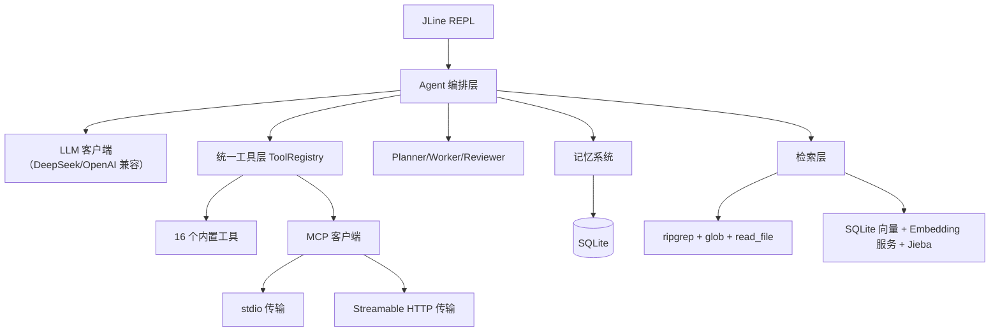

# minicli 技术设计（怎么设计）

- 状态：草稿 v0.1
- 更新时间：2026-08-13

## 1. 技术栈

| 领域 | 选型 | 用途 |
| --- | --- | --- |
| 语言 | Java 21 | 虚拟线程支撑高并发工具调用 |
| 构建 | Maven | 本机已装 3.9.10，单模块 pom 即可 |
| 终端 UI | JLine 3.x（3.26.3） | REPL、多行输入、流式渲染 |
| 数据库 | SQLite（JDBC + Flyway 或自研迁移） | 会话、消息、记忆、审计、向量 |
| Git | JGit | 仓库内嵌 git 操作（状态、diff、提交） |
| 浏览器 | Chrome DevTools Protocol | 网页调试工具 |
| 分词 | Jieba（Java 版） | 中文检索关键词与 chunk 处理 |
| HTTP/SSE | OkHttp | DeepSeek/OpenAI 兼容 API、Streamable HTTP MCP |
| LLM | DeepSeek API（OpenAI 兼容） | 对话、Function Calling、reasoning、流式 |
| Embedding | 待定（M7 确认 OpenAI 兼容端点） | RAG 向量化 |

注意：JDK 21 已通过 Homebrew 安装并注册（`/usr/libexec/java_home` 默认解析为 21）。

## 2. 总体架构



依赖方向：`ui → agent → llm/tools/mcp/memory/retrieval`，全部依赖 `domain`（纯模型）；基础设施（db/config）只被上层接口引用。遵循 AGENTS.md：domain 不导入框架/SDK，API 不直接写 SQL，配置统一加载。

## 3. 包结构（Maven 单模块）

```
src/main/java/com/minicli/
├── Main.java                # 入口：装配 + 启动
├── config/                  # 唯一读取配置/环境变量的地方
├── domain/                  # 纯 Java 领域模型（见 4.1）
├── agent/
│   ├── core/                # ReAct 循环、会话状态机
│   ├── planner/             # DAG 拆分
│   ├── executor/            # Worker 池、并行调度
│   └── reviewer/            # 独立审核与重试
├── tools/
│   ├── spi/                 # Tool 接口、ToolSpec、ToolResult、注册表
│   ├── builtin/             # 内置工具（file/search/shell/git…）
│   └── audit/               # 调用审计
├── mcp/
│   ├── protocol/            # JSON-RPC、生命周期状态机
│   ├── transport/           # StdioTransport / StreamableHttpTransport
│   └── registry/            # 动态注册为统一工具
├── llm/                     # LLM 客户端（OpenAI 兼容：DeepSeek 等）、Function Calling、流式、reasoning
├── memory/
│   ├── model/               # 4 类记忆条目
│   ├── store/               # JSON 持久化、去重、检索
│   └── compress/            # Map-Reduce 压缩、事实回写
├── retrieval/
│   ├── precise/             # ripgrep + glob + read_file
│   └── rag/                 # 向量表、embedding、jieba
├── git/                     # JGit 封装
├── browser/                 # CDP 客户端
├── db/                      # SQLite 连接、迁移执行器
└── ui/                      # JLine REPL、流式渲染
```

## 4. 核心设计

### 4.1 领域模型（domain/）

- `Message`（role, content, reasoning, toolCalls, createdAt）
- `ToolSpec` / `ToolCall` / `ToolResult`
- `Plan` / `PlanNode`（dependsOn, status, attempts）/ `ReviewVerdict`
- `MemoryEntry`（type, projectScope, keywords, content, dedupHash, sourceRefs）
- `RetrievalHit`（path, lineRange, score, snippet）
- `McpServerConfig`、`McpToolSpec`

### 4.2 ReAct 主循环

1. 收集用户输入 + 上下文（记忆注入、最近消息）。
2. LLM Function Calling 输出：要么是最终回复，要么是 1..4 个工具调用。
3. 并发执行工具，记录审计；把 observation 回填消息。
4. 循环直到模型输出最终回复或达到 max-steps。
5. 每轮输出流式渲染；reasoning 单独通道回传 UI。

具体形态（2026-08-14 切片 2+3 落地）：

- `ReActAgent`（agent/core/）：维护 input items 列表（message + function_call + function_call_output），循环调用 `DeepSeekClient.askAgent`，直到 `functionCalls` 为空或达到 max-steps（默认 50，可由 MINICLI_AGENT_MAX_STEPS 配置）。
- `DeepSeekClient.askAgent(inputItems, toolSpecs)`：请求体带 `input`（数组）、`tools`（注册表说明书）、`tool_choice:"auto"`；从 `response.completed` 的 response.output 提取 function_call 项（call_id/name/arguments）。
- 工具结果回填前截断（默认 4000 字符）防上下文撑爆；未注册工具/参数解析失败也回填 FAILURE，不让异常中断循环。
- 输出模型：`FunctionCall(callId, name, argumentsJson)`、`LlmTurnResult(outputText, reasoningText, functionCalls)`。
- thinking 模式（2026-08-16 修复）：DeepSeek 要求继续循环时必须把上一轮的 reasoning 以 `{"type":"reasoning","content":[{"type":"reasoning_text","text":"..."}]}` 回传（官方 create-response 接口定义：reasoning item 的 content 为 reasoning_text 内容块列表），否则 HTTP 400。`ReActAgent` 在每轮继续前回填该 item。

### 4.3 工具抽象与并发

- `Tool` 接口：`name()`, `description()`, `inputSchema()`, `invoke(ToolCall) -> ToolResult`。
- `ToolRegistry`：内置工具启动注册，MCP 工具动态注册，统一索引。
- 并发执行器：虚拟线程 + 信号量，最多 4 路；每路调用写入 `tool_calls` 审计表。

落地状态（2026-08-16）：并发执行器已在 `ReActAgent` 内实现（`Executors.newVirtualThreadPerTaskExecutor` + `Semaphore(4)`，同一轮工具调用并行执行、结果按原始顺序回填）；审计暂缓（AuditStore 接口方案保留，SQLite 就绪后实现）。

具体形态（2026-08-14 切片 1 落地）：

- `Tool`（tools/spi/）：`name()` 唯一名、`description()` 用途说明、`inputSchema()` 入参 JSON Schema（org.json）、`invoke(JSONObject) -> ToolResult`。
- `ToolResult`（tools/spi/）：`status(SUCCESS/FAILURE)`、`output`、`error`；实现必须把异常转成 FAILURE，不得抛给上层。
- `ToolRegistry`（tools/spi/）：`register`（空名/重名拒绝）、`find`/`require`、`all`（注册顺序）、`size`。
- 首批内置工具（tools/builtin/，只读先行）：`read_file`、`list_dir`、`glob`；后续按 M2 补齐 16 个工具清单。

### 4.4 Plan-and-Execute + Multi-Agent

- Planner：把任务拆成 `PlanNode` 图，节点带 `dependsOn`。
- 调度：按拓扑分层，无依赖的节点组成一批并行下发。
- Worker 池：每个节点一个 worker，执行结果写回节点。
- Reviewer：对结果独立审核（规则 + LLM 校验），不通过按配置重试；达到上限标记失败。

### 4.5 MCP 客户端

- 生命周期状态机：`NEW → INITIALIZING → READY → CLOSED`，失败可重连。
- 协议层：JSON-RPC 2.0，消息 id 关联请求/响应，支持 notifications。
- 传输层抽象 `Transport`：`stdio`（进程 stdin/stdout）与 `Streamable HTTP`（SSE 流）。
- 动态注册：`tools/list` 返回的 tool 转成 `ToolSpec` 注册进 `ToolRegistry`；调用时映射回 `tools/call`。

### 4.6 记忆系统

- 4 类条目共用 `MemoryEntry`，type 区分 dialog/fact/summary/tool_result。
- 持久化：长期记忆 JSON 文件（按项目作用域分文件），启动加载进内存索引。
- 去重：内容规范化后取 hash（dedupHash），冲突时更新置信度/时间戳。
- 检索：关键词（Jieba 分词后倒排或 FTS）+ 项目作用域过滤。
- 压缩（Map-Reduce）：旧消息按 5 条分片 → 每片摘要 → 合并摘要；最近 3 轮完整保留；摘要中稳定事实提取后回写 fact 记忆。

### 4.7 检索（精确 + RAG）

- 精确路径：`glob` 收窄候选 → `ripgrep` 关键词/正则 → `read_file` 取片段；目标是 <200ms，先测基准再优化。
- RAG 兜底：文件切 chunk → Jieba 分词 → Embedding 服务（M7 确认端点）→ 向量落 SQLite；查询时同流程后取相似度 Top-K。
- 向量存储策略：优先 sqlite-vec 扩展；不可用时降级为 Java 内余弦相似度（chunk 数可控时可行）。

### 4.8 配置项（外部化）

所有可外部化配置统一放项目根目录 `.env`，由 `config/Config.java` 唯一加载（AGENTS.md 第 5 条）；取值优先级：.env > 同名系统环境变量 > 代码内默认值。`.env.example` 仅是 @root 个人使用的模板配置文件，不作为运行配置依据；真正生效的是 `.env`（gitignore 排除，不入库）。

| 分类 | 键 | 默认值 | 说明 |
| --- | --- | --- | --- |
| LLM | DEEPSEEK_API_KEY | 无（必填） | DeepSeek API 密钥，只放 .env |
| LLM | DEEPSEEK_MODEL | 无（必填） | 模型名，如 deepseek-v4-flash |
| LLM | DEEPSEEK_BASE_URL | https://api.deepseek.com | OpenAI 兼容 API 基础地址 |
| 网络 | DEEPSEEK_CONNECT_TIMEOUT_SECONDS | 10 | 与 API 建立连接的超时（秒） |
| 网络 | DEEPSEEK_READ_TIMEOUT_SECONDS | 120 | 流式响应读取超时（秒） |
| Agent | MINICLI_AGENT_MAX_STEPS | 50 | ReAct 最大循环步数 |
| Agent | MINICLI_AGENT_MAX_CONCURRENCY | 4 | 同一轮工具调用最大并发数 |
| Agent | MINICLI_AGENT_MAX_OBSERVATION_CHARS | 4000 | 工具观察结果回填前的截断字符数 |

## 5. 数据库表（SQLite）

| 表 | 用途 | 关键字段 |
| --- | --- | --- |
| schema_migrations | 迁移版本 | version, applied_at |
| project_scopes | 项目作用域 | id, path, name |
| conversations | 会话 | id, scope_id, title, created_at, updated_at |
| messages | 对话消息 | id, conversation_id, role, content, reasoning, created_at |
| memories | 4 类记忆 | id, type, scope_id, keywords, content, dedup_hash, source_refs, created_at, updated_at |
| tool_calls | 调用审计 | id, session_id, tool_name, input_json, output_json, status, latency_ms, batch_id, started_at, finished_at |
| plan_nodes | 计划节点 | id, plan_id, name, depends_on, status, attempts, review_status, worker, result |
| chunks | 检索分片 | id, path, start_line, end_line, content, content_hash, lang |
| embeddings | 向量 | chunk_id, model, dims, vector BLOB |

变更顺序：先写迁移与约束 → 再改 ORM/服务/API（遵循 AGENTS.md 第 4 条）。

## 6. 错误处理与可观测性

- LLM：连接失败/超时/空响应/密钥缺失均转化为可读错误；Function Calling 输出非法时重试一次并降级提示。
- MCP：进程退出、SSE 断流、超时触发重连；审计记录失败原因。
- 工具：异常捕获为 `ToolResult.failure`，不让异常打断 ReAct 循环。
- 日志：分层 logger，审计落 SQLite；终端只展示用户可读信息。
